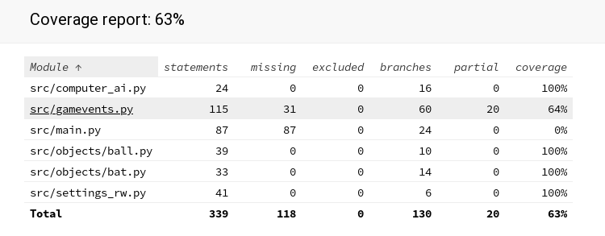

 
# APCA Testausdokumentti

Sovellusta on testattu pelaamalla peliä, eri pelaajien toimesta, käyttämällä unittestin automatisoitua yksikkö- ja integraatiotestausta. Testejä on suoritettu eri alustoilla (OpenSuse, Windows 10 ja HY:n etätyöpöytä), joissa python versio vähintään 3.6.9.

## Yksikkö ja integraatiotestaus

Yksikkö- ja integraatiotestauksella on testattu objects-luokan ja sovelluslogiikan osia. Testikattavuudeksi saatiin 63%.

Objects-luokkaa testaavat ball_test.py ja bat_test.py. Näiden antavat luokan testikattavuudeksi 100%. Sovelluslogiikkaa testaavat computer_ai_test.py, gamevents_test.py ja settings_rw_test.py. Tietokonepelaajan toimintaa testaava computer_ai_test.py ja tiedoston lukemista ja kirjoittamista testaava settings_rw_test.py kattavat luokkiensa testauksesta 100%. Gamevents_test.py kattaa gamevents-luokan testauksesta 64%. Testauksesta on jätetty pois sellaiset funktiot, jotka odottavat syötettä näppäimistöltä tai kutsuvat tällaista funktiota. Main.py luokkaa varten ei ole myöskään saman syyn vuoksi tehty automaattista testausta.

## Käyttöliittymä

Käyttöliittymälle ei ole tehty automaattista testausta. Käyttöliittymää on testattu vain manuaalisesti pelaamalla ja kokeilemalla peliä mahdollisimman monipuolisesti.
