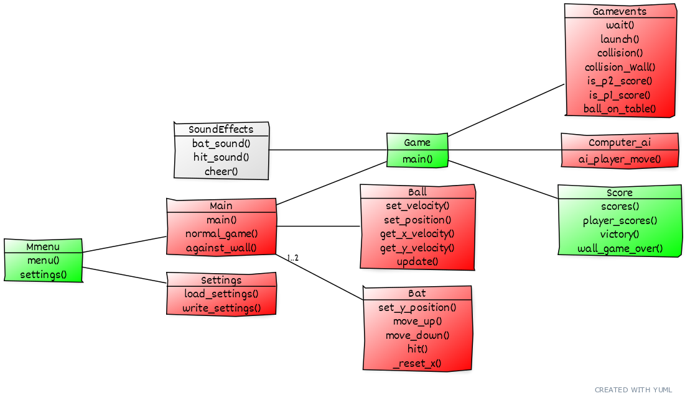
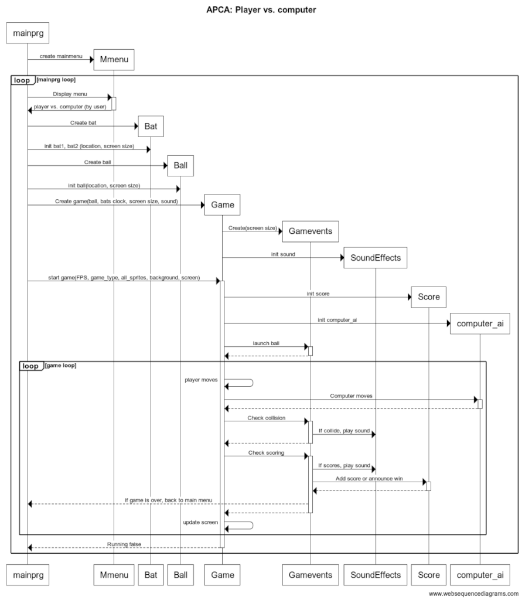

# Arkkitehtuurikuvaus

## Rakenne

Sovelluksen rakenne koostuu kuvassa olevista kymmenestä luokasta. Näiden luokkien lisäksi sovellus sisältää pelikenttien taustat, pallon ja mailan, sekä äänitiedostot äänitehosteille. Sovelluksen pakkausrakenne on jaettu osiin ui, objects. Src kansiossa sijaitsee sovelluslogiikka, ui kansiossa ovat Käyttöliittymään liittyvät luokat ja objects-kansiossa sprite-oliot. Luokkakaaviossa luokat ovat värjätty pakkauksen mukaisesti. Sovelluslogiikka on punaisella, Käyttöliittymän luokat vihreällä ja oliot siniharmaalla. Lisäksi assets kansiossa on grafiikoiden tarvitsemat tiedostot ja äänitiedostot alikansiossa sounds. 

### Käyttöliittymä 
 Käyttöliittymän luokkia ovat luokat Mmenu, game, score ja soundEffects. Mmenu sisältää päävalikon ja asetukset valikon. Päävalikossa voidaan valita haluttu peli, siirtyä asetusvalikkoon tai poistua pelistä. Asetukset valikko on omana näkymänä ja siitä voidaan määritellä peliruudun koko, valita ovatko äänet päällä vai pois, sekä valita tietokonepelaajan vaikeusaste. Asetukset tallennetaan apca_settings.txt tiedostoon. Tiedoston lukemisesta ja kirjoittamisesta huolehtii sovelluslogiikan luokka SettingsRW. Score luokka hoitaa pisteisiin ja pelin päättymiseen liittyvät ilmoitukset. Se myös hoitaa pisteiden tulostamisen näytölle. Game sisältää gameloopin, joka huolehtii peliruudun piirtämisestä ja päivittämisestä, sekä näppäimistön lukemisesta. SoundEffects luokka huolehtii äänitehosteista sovelluslogiikan Gameventsin-luokan pyyntöjen mukaisesti.
 
 
### Sovelluslogiikka ja objektit
 Main luokka käynnistää ohjelman ja luo Mmenun ja huolehtii pelin käynnistämisestä ja alustaa spritet mailoille ja pallolle, jotka objects kansiossa olevat sprite-oliot. Peli käynnistyy, kun pelaaja on valinnut haluamansa pelitavan, jolloin main luokka kutsuu käyttöliittymän gameluokkaa. Game luokka käynnistää pelin ja sen pääsilmukasta kutsutaan Gamevents luokkaa pelin tapahtumien tarkistamiseksi. Computer_ai luokkaa käytetään player vs. computer pelimoodissa, jolloin pelaaja 2 näppäimet ovat poistettu käytöstä.
    
SettingsRW luokka huolehtii asetustiedoston lukemisesta ja kirjoittamisesta. Sovelluksen käynnistyessä mainluokka pyytää SettingRW lukemaan asetustiedoston. Jos sitä ei löydy, niin se luodaan Main-luokan sisältämän oletuksen mukaan. apca-settings.txt tiedosto sisältää: ruudunleveys, ruudunkorkeus, äänet päällä/pois, tietokoneen vaikeustaso, HiScore small, HiScore medium ja HiScore large. Tiedot on tallennettu tiedostostoon string tyyppisenä.
Luokka saa ja palauttaa asetukset listana. Oletusasetukset ovat: [800, 600, "False", "easy", 0, 0 ,0].
 
## Toiminta
Seuraava sekvenssidiagrammi kuvaa sovelluksen toimintalogiikka pelaaja vastaan tietokone pelimoodissa.
 
 
 
Käynnistettäessä peli, alustetaan tarvittavat asetukset ja mmenu. Tämän jälkeen alkaa pääohjelman pääsilmukka, joka ensin käynnistää päävalikon ja odottaa käyttäjän tekemää valintaa. Käyttäjän valitessa sekvenssidiagrammin mukaisen peli tietokonetta vastaan, alustetaan pelin tarvitsemat luokat ja asetukset. Tämän jälkeen aloitetaan käyttöliittymän game.py pääsilmukka, jota suoritetaan pelin päättymiseen saakka. Pelin loputtua palataan pääsilmukkaan ja odottamaan seuraavaa käyttäjän valintaa.
 Muita pelitapoja kuvaava sekvenssidiagrammi olisi melko samanlainen, vain pieniä eroja. Esimerkiksi kaksinpelissä computer_ai ei ole käytössä ja pelaaja 2 toimii pelaajan 1 tavoin. Yksinpelissä mailoja ja pelaajia on vain yksi, eikä myöskään computer_ai ole käytössä. Ääniefektit voidaan asetusvalikosta ottaa pois päältä, jolloin soundEffects luokka ei ole käytössä, eikä kutsuja tähän luokkaan tehdä.
